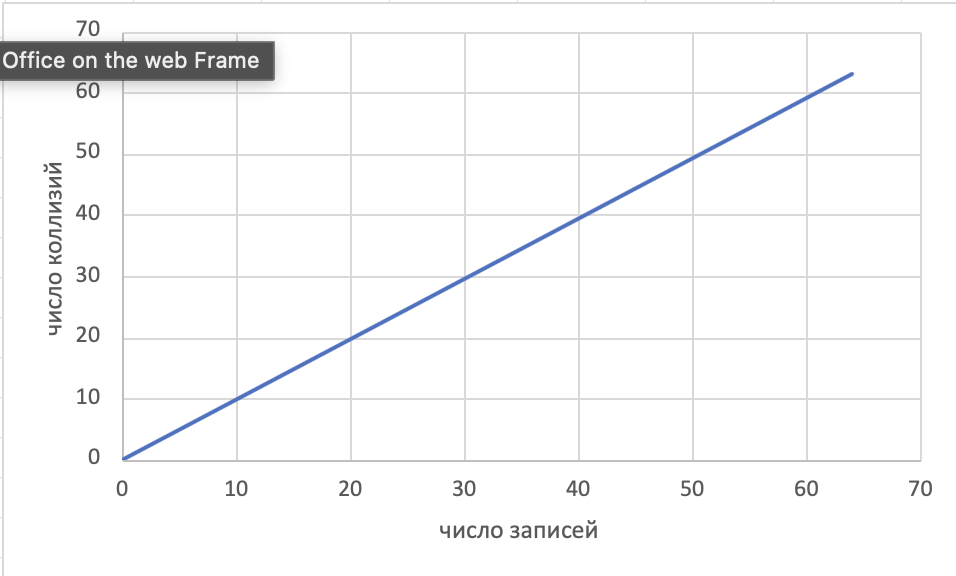

Министерство образования Республики Беларусь

Учреждение образования

“Брестский Государственный технический университет”

Кафедра ИИТ

       

Лабораторная работа №1

По дисциплине “Аппаратное обеспечение интеллектуальных систем”

Тема: “Применение хэширование для ассоциативного поиска по ключам”

Вариант 4

     

Выполнил:

Студент 2 курса

Группы ИИ-27

Дорошенко М.Д.

Проверил:

Михно Е.В.

     

Брест 2026

# Содержание
1) [Цель работы](#цель-работы)
2) [Задание](#задание)
3) [Ход работы](#ход-работы)

- 3.1. [UML диаграммы](#uml-диаграммы)
- 3.2. [Работа программы](#работа-программы)
- 3.3. [Главное меню](#главное-меню)
- 3.4. [Обычная таблица](#обычная-таблица)
- 3.5. [Хэш-таблица](#хэш-таблица)
- 3.6. [Графики](#графики)
- 3.7. [Результаты тестирования](#результаты-тестирования)
- 3.8. [How to Run](#how-to-run)
- 3.8.1 [Windows](#windows)
- 3.8.2 [MacOS](#macos)
- 3.8.3 [Linux](#linux)

# Цель работы
Изучить основные принципы хэширования, построить программную модель,
обеспечивающую формирование хэш-таблиц и ассоциативный поиск по ключам.

# Задание
 1) Написать на ЯВУ программу, осуществляющую просмотр, модификацию и сохранение таблицы
записей. Реализовать добавление, удаление, редактирование записей и поиск по ключу перебором.
Таблица должна содержать N строк (в таблицу заносится n записей) и не менее трех полей (с одним
ключевым полем).
 2) Написать на ЯВУ программу, которая преобразует таблицу данных из первого задания в хэш-
таблицу на N строк (n записей). Для хэш-таблицы реализовать возможности добавления, удаления,
модификации и поиска записей. Хэш-функция и метод обработки коллизий выбираются согласно
варианту. Рассчитать вероятность возникновения коллизий (количество возникших коллизий при
добавлении данных разделить на количество добавленных в хэш-таблицу записей) и среднее количество
обращений к таблице во время поиска записи по ключу (сумма количества обращений к таблице при
поиске каждой записи в хэш-таблице деленная на количество записей в хэш-таблице).

| Вариант | Тип хэш-функции  | Метод обработки коллизий | Количест- во записей n | Объем хэш-таблицы N |
|:----------:|----------|----------|:----------:|:----------:|
| 4 | Мультипликативный (все символы) 2 цифры + метод квадрата | линейное зондирование | 40 | 64 |

# Ход работы
[Назад к содержанию](#содержание)

В ходе данной лабораторной работы я освоил базовую реализацию функции хэширования для таблицы, состоящую из 3-х колонок.
Также воспользовался системой контроля версий(СКВ) Git и его приемником для хранения кода в открытом доступе GitHub.
Данная работа использует репозиторий для работы с TUI: [https://github.com/ArthurSonzogni/ftxui](https://github.com/ArthurSonzogni/ftxui)

## UML диаграммы
[Назад к содержанию](#содержание)

Для облегчения чтения кода, а также понимание взаимодействия между модулями моей программы, приведу следующую UML диаграмму:

## Работа программы
[Назад к содержанию](#содержание)

Какой же отчет может быть без показания взаимодействия пользователя с программой.
Ну что ж пройдемся по каждому пункту...

### Главное меню
[Назад к содержанию](#содержание)

### Обычная таблица
[Назад к содержанию](#содержание)

### Хэш-таблица
[Назад к содержанию](#содержание)

## График
[Назад к содержанию](#содержание)

По заданию необходимо продемонстрировать в виде графика зависимости числа добавленных записей от числа коллизий.
По оси Х будет располагаться число записей, а  по оси Y - текущее суммарное число коллизий.

## Результаты тестирования
[Назад к содержанию](#содержание)

Куда же без наших тестов...
В данных тестах мы будем проверять нашу хэш-таблицу на работоспособность (Добавление, Удаление, Редактирование, Нахождение записи по ключу).

# How to Run
[Назад к содержанию](#содержание)

## Windows
[Назад к содержанию](#содержание)

Необходимо убедиться, что мы находимся в папке lab1, иначе необходимо перейти в нее (если мы находися в корне проекта: AOIS): 
`cd lab1`

И далее выполнить .bat файл: 
`./build.bat`

После успешного выполнения скрипта запустить программу: 
`./build/LAB1_AOIS_ii02707`

## MacOS
[Назад к содержанию](#содержание)

Необходимо убедиться, что мы находимся в папке lab1, иначе необходимо перейти в нее (если мы находися в корне проекта: AOIS): 
`cd lab1`

Далее необходимо выдать права для нашего .sh файла для запуска: 
`chmod 0777 ./build.sh`

И далее выполнить .sh файл: 
`./build.sh`

После успешного выполнения скрипта запустить программу: 
`./build/LAB1_AOIS_ii02707`

## Linux
[Назад к содержанию](#содержание)

Необходимо убедиться, что мы находимся в папке lab1, иначе необходимо перейти в нее (если мы находися в корне проекта: AOIS): 
`cd lab1`

Далее необходимо выдать права для нашего .sh файла для запуска: 
`chmod 0777 ./build.sh`

И далее выполнить .sh файл: 
`./build.sh`

После успешного выполнения скрипта запустить программу: 
`./build/LAB1_AOIS_ii02707`
